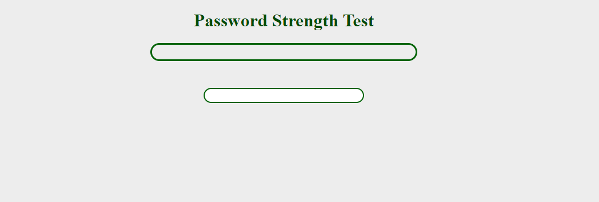

\-\- Password Meter Test Project
 

- Javascript
- HTML
- CSS

***Simple JavaScript Project to test password strength.***

**Initial State:**

**Weak Password:**

**Dynamically displays error messages**

